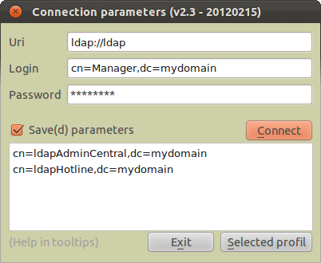
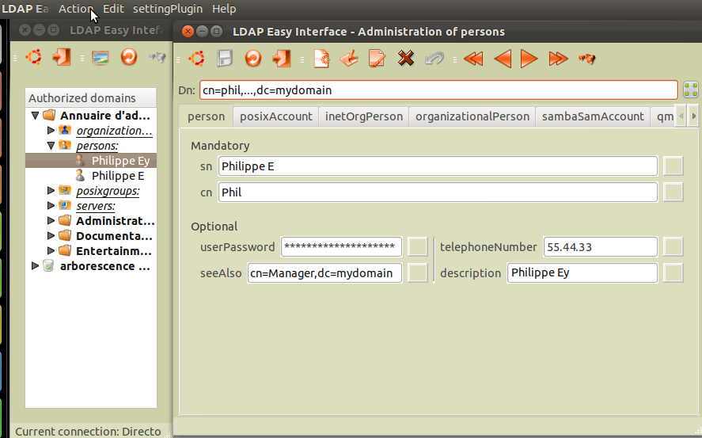
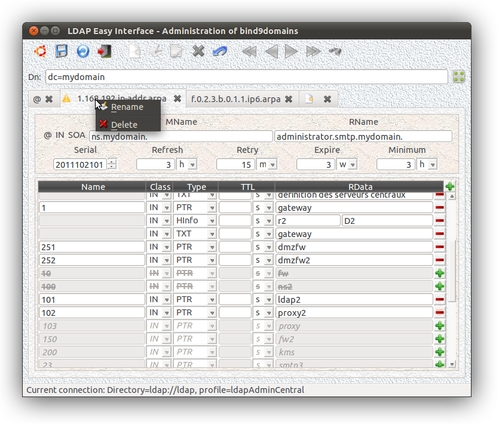
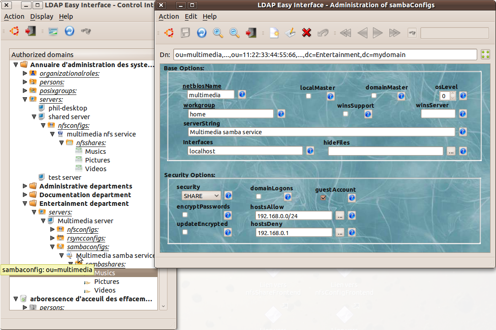
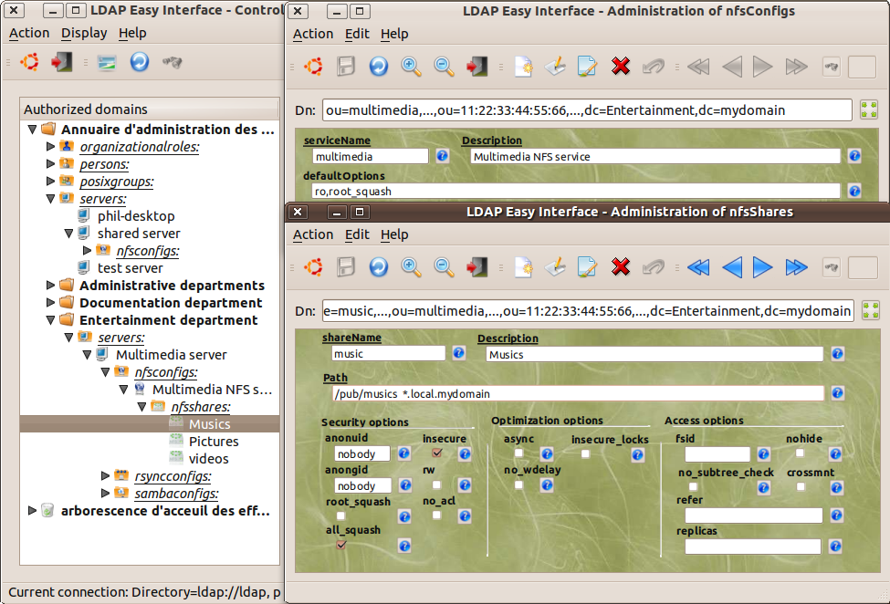
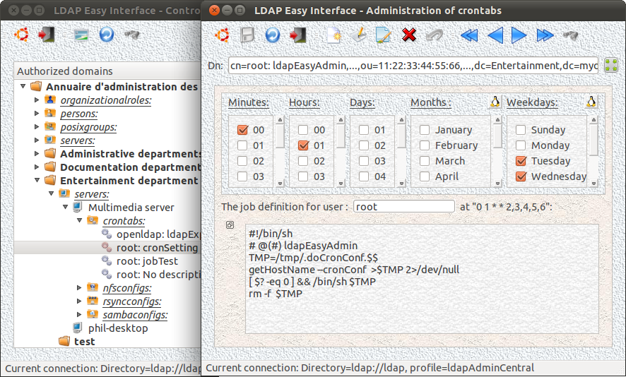

LdapEasyInterface 1.0 for C++ programmers - 2010 April

Notice 2017: this project is old and must be update
according to the new C++ standard. But this work can be
useful and is offered here without any guarantee.
Enjoy... ;-)

2010:

    This package is the first distributed version of this
    new library. It's an interface between the great
    openLdap API C (cf. <http://www.openldap.org/>) and
    all C++ applications which will be linked with it.

    This work constitutes my first experience of
    development of a GNU project as well as, at the same
    time, of a C++ project (that I've learnt very very
    long ago ...). I began this project a few months ago,
    simultaneously in a other one which requires the use
    of the Qt framework (which is an other first
    experience for me) and a LDAP directory as database.

    The initial objective of this development was to
    have an easy to use interface LDAP which allows me
    to free myself from the complexity of the C
    interface with a LDAP directory (an other relatively
    recent topic for me ;-) ; so all my attention was
    then able to be to concern the initial objective of
    my developments:
        a suite of graphic interfaces for the tune of a
    LDAP directory intented for the administration of
    services and servers constituting a large intranet.
    (I intend to publish also the first results of this
    other work soon ...)
    In fact, I've prevously worked (during the last past
    year) on several tools allowing to configure (and
    automatic upgrades) Linux systems by interfacing
    LDAP definitions and Unix configue file system. But,
    I'll speak about it later (as far as it really
    interests somebody ;-)

    This C++ library supplied to the programmer some
    tools facilitating the manupilation of a LDAP
    database.

    It provides an "ldapEasyInterface" object (and
    associated methods) which includes:
        - an input buffer, 
        - an output buffer (or results buffer),
        - a backup buffer which allows temporary savings
          of precedents buffers (allowed to repeat or
          chain requests), 
        - and differents methods to manipulate LDAP
          concepts (and buffers contents) in a easy way.
    
    This notion of buffers allows in particular the
    batch processings of the LDAP requests (eg: the
    methods "doAddSearchScope...()" vs
    "doSearchScope...()" ) as well as the chain of
    requests (ie.: method "doSwapEntriesAndResults()").

    I hope this first work could be usefull for other
    people.

## USE EXEMPLE (ldapEasyAdminFrontends) :

 

 

 

 

 

 

